# Cat Shop - Tienda para Felinos

## Descripción

Cat Shop es una tienda en línea especializada en productos para gatos, desarrollada con Next.js y React. La aplicación permite a los usuarios explorar productos, añadirlos al carrito de compras y realizar pagos utilizando una integración con una API de pagos.

## Tecnologías Principales

- **Next.js 15.3.2** - Framework React para renderizado del lado del servidor
- **React 19.0.0** - Biblioteca para construir interfaces de usuario
- **TypeScript** - Tipado estático para JavaScript
- **Tailwind CSS 4** - Framework CSS utilitario

## Características

- Listado de productos con imágenes, nombres y precios
- Carrito de compras con gestión de cantidades
- Procesamiento de pagos con múltiples bancos
- Verificación de estado de pagos
- Interfaz responsive y moderna
- Carga progresiva con esqueletos

## Estructura del Proyecto

```
/app                   # Rutas y páginas de Next.js
/components            # Componentes reutilizables
  /cart                # Componentes del carrito
  /product             # Componentes de producto
  /ui                  # Componentes de UI genéricos
/domain                # Interfaces y tipos de dominio
/providers             # Proveedores de contexto
/services              # Servicios para acceso a datos
/public                # Archivos estáticos
```

## Integración con API de Pagos

La aplicación integra con una API de pagos externa que permite procesar transacciones y verificar su estado. Para configurar esta integración, se requieren las siguientes variables de entorno:

```
PAYMENT_API_URL='https://payment-api.khipu.com/v3'
PAYMENT_API_KEY='your-api-key'
```

### Cómo funciona la integración:

1. **Selección de productos**: El usuario añade productos al carrito.
2. **Checkout**: En la página del carrito, se muestran los productos seleccionados y el total.
3. **Selección de banco**: El usuario selecciona un banco para realizar el pago.
4. **Procesamiento del pago**: Se envía la solicitud a la API de pagos, que retorna un ID de transacción.
5. **Verificación del estado**: El usuario puede verificar el estado de su pago utilizando el ID de transacción.

### Servicios de Pago

La integración utiliza varios servicios:

- `PaymentService.getBanks()`: Obtiene la lista de bancos disponibles para pago.
- `PaymentService.createPayment()`: Crea una nueva solicitud de pago.
- `PaymentService.getPaymentStatus()`: Verifica el estado de un pago existente.

## Configuración

1. Clona el repositorio
2. Instala las dependencias con `npm install`
3. Crea un archivo `.env.local` con las variables de entorno necesarias
4. Ejecuta el servidor de desarrollo:

```bash
npm run dev
# or
yarn dev
# or
pnpm dev
```

5. Abre [http://localhost:3000](http://localhost:3000) en tu navegador

## Flujo de Pruebas

A continuación se describe el flujo de pruebas para verificar el funcionamiento correcto de la aplicación:

### Pruebas de la Integración de Pagos

El proceso completo desde la selección de productos hasta la confirmación del pago se muestra en las siguientes imágenes:

1. **Vista de la página de inicio con los productos**
   
   

2. **Añadir productos al carrito**
   
   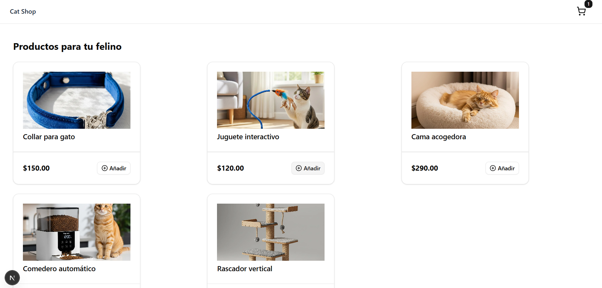

3. **Ver detalles del carrito**
   
   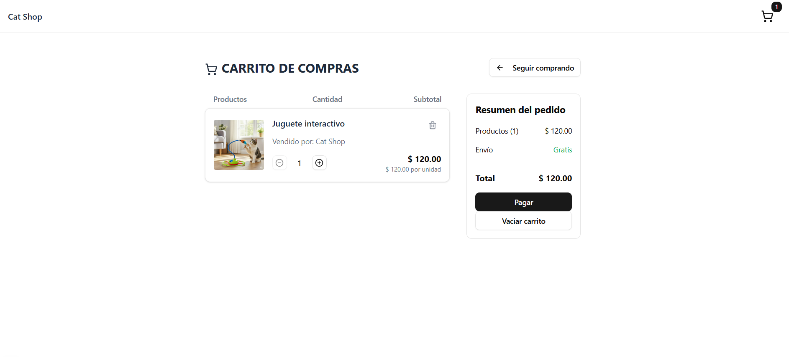

4. **Seleccionar banco para el pago**
   
   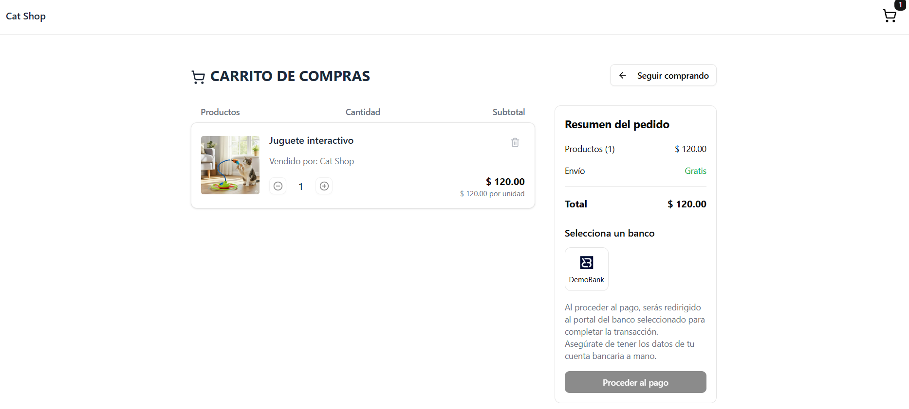

5. **Validación del monto mínimo**
   
   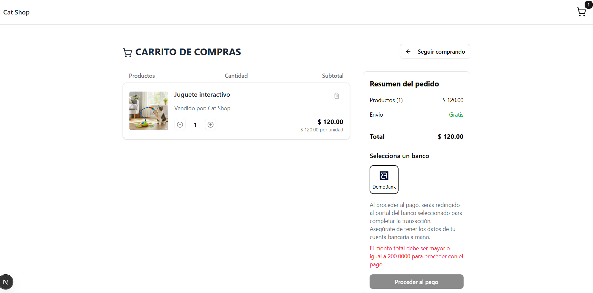

6. **Añadir más productos si es necesario**
   
   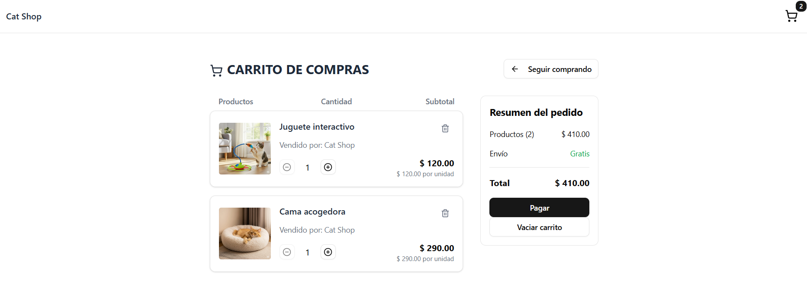

7. **Procesar el pago con el monto correcto**
   
   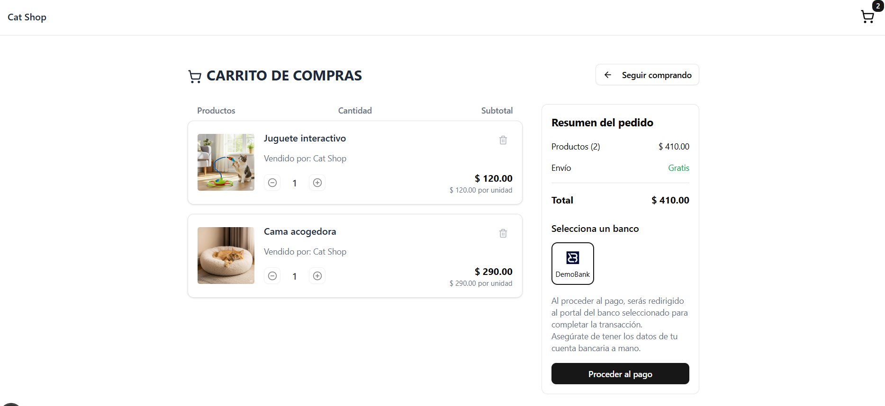

8. **Confirmación de creación del pago**
   
   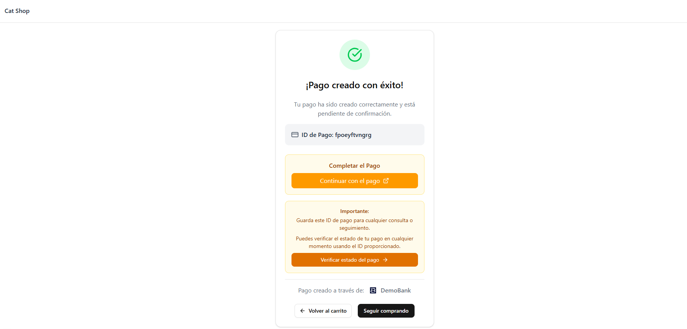

9. **Proceso de pago en la plataforma del banco**
   
   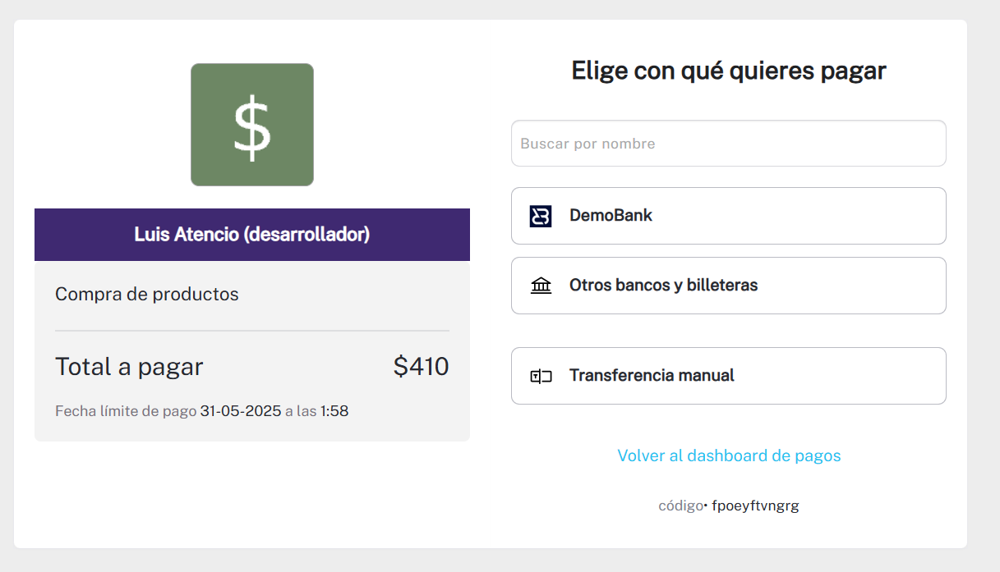

10. **Confirmación en la cuenta del banco**
    
    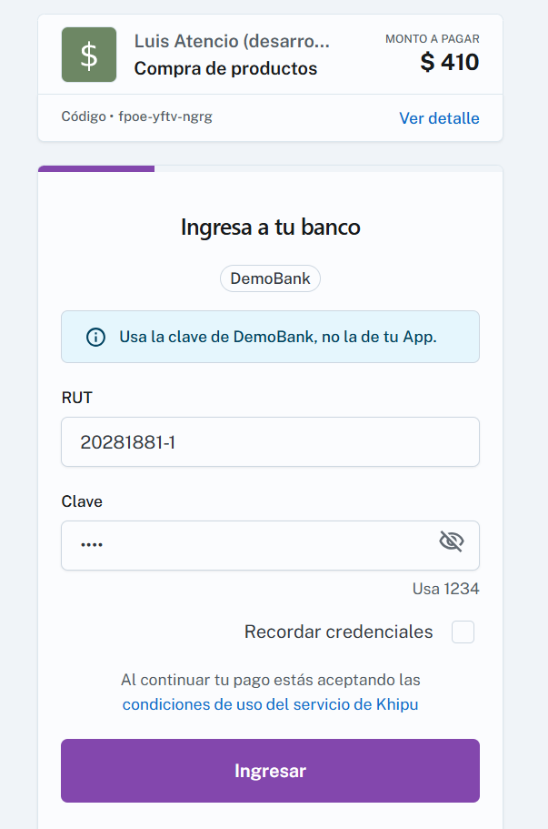

11. **Verificación del estado del pago**
    
    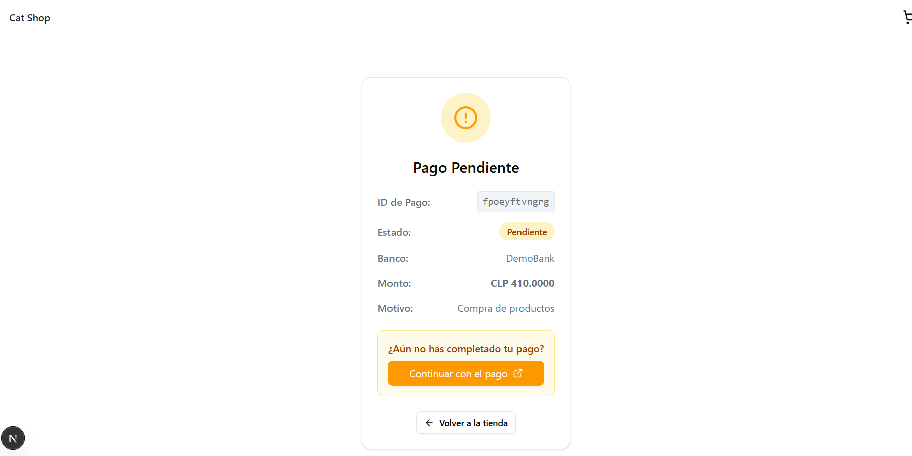

12. **Confirmación de pago completado**
    
    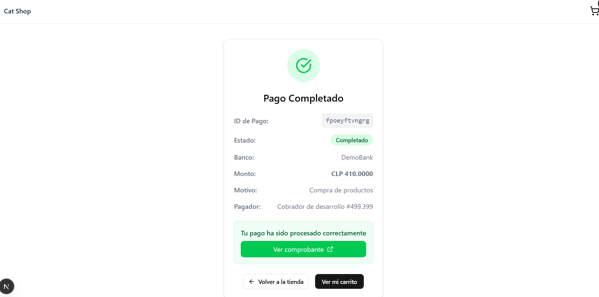
